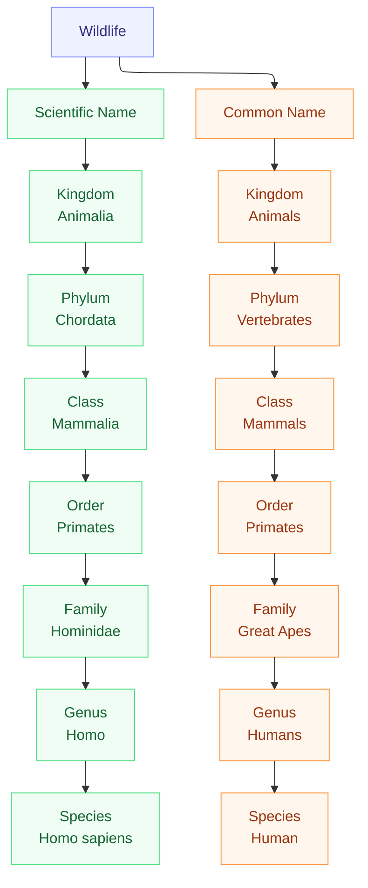
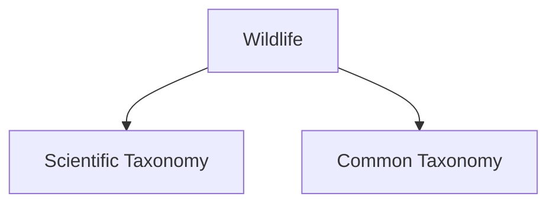

# Wildlife Taxonomy for ACDSEE with both latin and common names

This document describes how PhotoTag processes the
iNat21 taxonomy to generate an **ACDSee‑importable Category XML file**
so that any tagged photo will automatically appear under the correct categories
inside ACDSee, enabling search and filterin by either scientifi or common english name.

## 1. iNat21 Species Structure

Each species entry in the iNat21 taxonomy contains **two leaf‑level names**:

- Scientific species name (Latin), e.g. Lumbricus terrestris
- Common species name, e.g. Common Earthworm

These two names refer to **exactkly the same species** and are both leaf identifiers.

In the iNat21 dataset (taxonmy.json) kingdom → phylum → class → order → family → genus are
**the scientific names only** - iNat21 does not provide a native common‑name hierarchy like birds -> raptors -> owl ->barn owl.

## 2. The desired category structure

PhotoTag  builds both scietific and common  hierarchies into one consistent set of categories that can be imported directly into acdsee as follow.


This hierarchy of categoreis (as they are called in ACDSee) are **not** written directly into the sidecar XMP fior a given image only Scientific Species Name and Common Species Name will show up there as ACDsee sotres categroies internally in its SQLliteDB

## 3. Lookup Files Produced by the Pipeline

The pipeline produces a set of stable lookup artifacts (stored in the model directory) that the ACDSee Category Pack generator consumes to build the two-tree XML import.

### taxonomy_flat.json

One record per species with resolved scientific ranks (kingdom → genus), species (scientific name), and available common-name fields. Primary canonical input for the scientific tree.

### common_hierarchy.json

Nested structure representing the common-name hierarchy (common class → common order → … → common species). Used to build the Common Taxonomy tree without recomputing grouping from per-species records.

### reverse_lookup.json

Maps common species name → scientific species name. Used by XMP writers and for verification when a photo has only a common-name match.

### translation_table.json

For each scientific species name, lists the common-name ranks and the canonical common species name. This is the authoritative mapping the XMP writer uses to write the two leaf values per photo.

## 4. ACDSee Category Pack Generation

### acdsee_category_pack.xml (generator output)

The single Category Pack XML that ACDSee imports. It contains:

```xml

Wildlife → Scientific Taxonomy → ... → <Scientific Species>
Wildlife → Common Taxonomy → ... → <Common Species>

```

The generator produces deterministic, sorted XML so imports are stable and repeatable.

## 5. What the XMP Writer Needs Per Photo

For each tagged photo, the XMP writer uses the lookup files to determine:

- scientific_name (Latin species)
- common_name (common species)

These two values are written into the XMP metadata for the same image.

ACDSee then uses the imported Category Pack to place the photo under the correct
categories automatically.

## 6. Summary

- iNat21 provides two leaf names per species: scientific + common.
- PhotoTag builds two conceptual hierarchies internally.
- We generate a **single ACDSee Category Pack**:



- The XMP writer stores **two leaf values** (scientific + common) for each photo.
- ACDSee uses the imported XML to categorise photos automatically.

## Notes on responsibilities and behavior

- The flattener (now in taxonomy) should be run first to produce the lookup files. The generator (taxonomy/acdsee_generator.py) reads these lookups and emits acdsee_category_pack.xml.
- The XMP/sidecar writer only needs to write two leaf values per image: scientific_name and common_name (looked up via translation_table.json). ACDSee will place photos according to the imported Category Pack.
- The generator handles missing common names gracefully (configurable fallback), and sorts children consistently to make XML deterministic for CI and diffs.